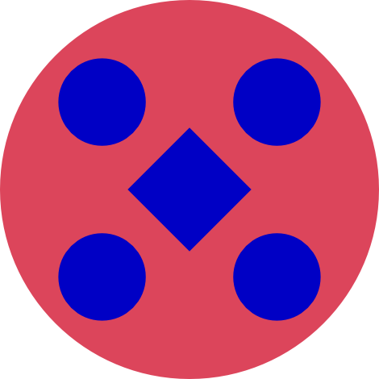

# Welcome to the heaven of failures!

This is my lab notebook for e-textiles: a place to document *experi*ments and *experi*ences.

This site is part of my Masters studies in [Vilnius Academy of Arts (VDA)](https://www.vda.lt/en/) Fashion Design programme. Master studies supervisors: creative work Doc. Dainius Bendikas, research Doc. Dr. Deima Katinaitė.

In 2023, I completed [Fabricademy](https://textile-academy.org/) course, which greatly inspired me to continue on this path. I sincerely recommend this course to anyone who is curious and wants to expand their knowledge in the field of textile technology. 


# Documentation

During the course, I met some very inspiring people who showed me so much that it was simply impossible to stop :) I am very grateful to my mentor Nuria Robles Miguelez, who taught me [how to document creative processes](https://class.textile-academy.org/2023/ieva-dautartaite/). Inspired by her and Fabricademy course, I created this site so that failures and successes would be visible and unforgettable.


# Site

I'm not a coder, so I'll post some ready-made codes and links here, which took me a while to collect into one pile.

James Willett provides very clear steps to follow.
Tuttorials on [Youtube](https://www.youtube.com/watch?v=pPEUhfTZswc) and his [website](https://jameswillett.dev/)
You can [download starter package](https://tinyurl.com/3n4tjmnn) to build.

Thomas Wilde created very cozy and [clear video](https://www.youtube.com/watch?v=DeZjkCtttss) with nice musical background.


## Tools

This site is build on [GitHub](https://github.com/) platform using [Material for MkDocs](https://squidfunk.github.io/mkdocs-material/) theme. It took me one week to remember and understand how to build the site, but the effort was worth it and now I can share some tips.
Here you will find codes and programs for Windows.

[Visual Studio Code](https://code.visualstudio.com/) and extensions

- Git Graph
- YAML by Red Hat
- Material Icon Theme

[Window PowerShell](https://apps.microsoft.com/detail/9mz1snwt0n5d?hl=en-US&gl=US)


[Git](https://git-scm.com/)


[Python](https://www.python.org/)


## Installation

Create project folder. Here you can add the downloaded files from [starter package](https://tinyurl.com/3n4tjmnn).

Local path: C:\Users\user\project

Type "System Properties" and go to Environment Variables...Path...Edit...Add New (push OK in every window)

=== "Visual Studio Code"

    1. cd "C:\Users\user\project"
    2. where python
    3. python -m venv venv
    4. .\venv\Scripts\activate
    6. pip --version
    7. pip install mkdocs-material
    8. mkdocs serve

=== "To publish on GitHub"

    1. git add .
    2. commit -m $'Setting up for CI deploy
    3. git push origin main

=== "PowerShell"
    To clean the cash
    * pip cache purge


## Markdown

Here you will find some markdown examples.

```
int sensorPin = A0;   // select the input pin for the potentiometer
int ledPin = 13;      // select the pin for the LED
int sensorValue = 0;  // variable to store the value coming from the sensor
```

``` py hl_lines="2 3"
int sensorPin = A0;   // select the input pin for the potentiometer
int ledPin = 13;      // select the pin for the LED
int sensorValue = 0;  // variable to store the value coming from the sensor
```

``` py title="code with title"
int sensorPin = A0;   // select the input pin for the potentiometer
int ledPin = 13;      // select the pin for the LED
int sensorValue = 0;  // variable to store the value coming from the sensor
```

| Method      | Description                          |
| ----------- | ------------------------------------ |
| `GET`       | :material-check:     Fetch resource  |
| `PUT`       | :material-check-all: Update resource |
| `DELETE`    | :material-close:     Delete resource |


#### How to fetch images

``` py title="image markdown"
{ width=100 align=center }
```

{ width=100 align=center }

``` py title="image with caption markdown"
{ width="100" }
/// caption
Image caption
///
```

{ width="100" }
/// caption
Image caption
///

``` py title="full size image markdown"
{ loading=lazy }
```

{ loading=lazy }


